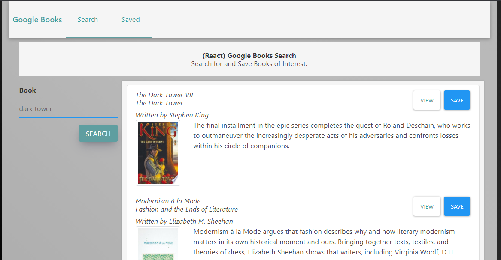
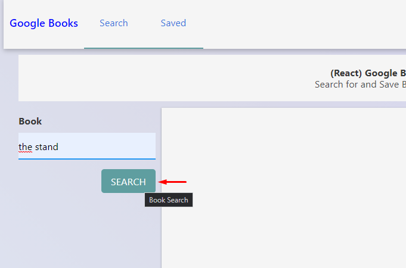
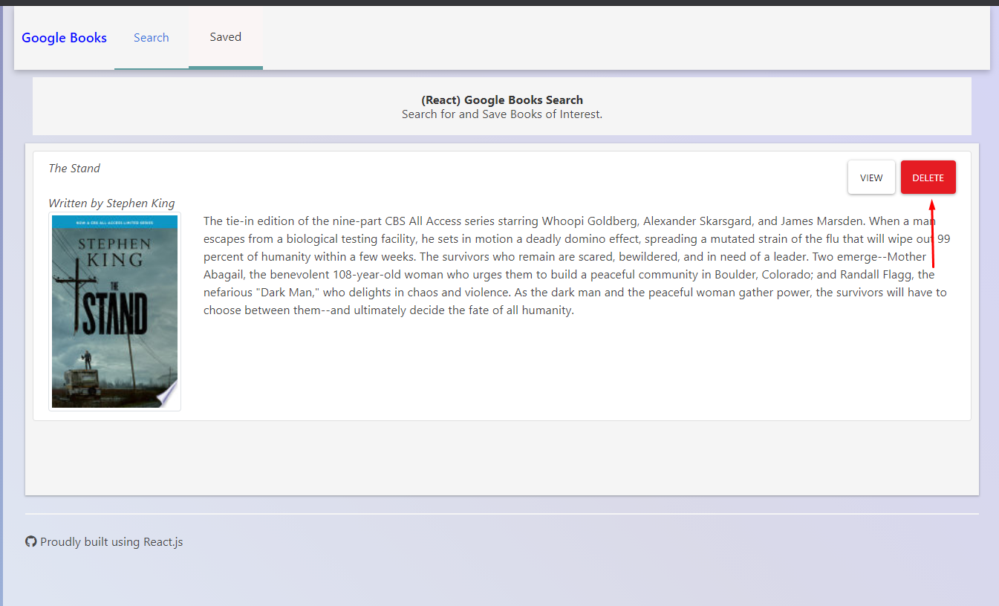

# Google books search 

## Menu

[1-Proyect Description](##Proyect-Description)

[2-Deployed Application](##Deployed-application)

[3-Proyect Usage](##Proyect-Usage)

[4-User info](##User-info)

## Proyect Description

A web page built with react where you can find books from google books and add them to your collection.

## Deployed application

[Go to site](https://pepe30-google-book.herokuapp.com/)

## Proyect Usage

1-In the page within the search section write the name of the book you want to find or any text related with the title.

2-There will be results based in the search, you can select the desired book to your colection by clicking in the save button. If you click on the view button another tab will be open to show the google books page. 

3-in the saved section you will see your saved books. To remove a book from your list, click on the <delete> button.

## User info

[GitHub User: jpineda30](https://github.com/jpineda30)

In case of any doubt or clarification, contact me at:  
Email: jose.pinedaesquer@gmail.com

